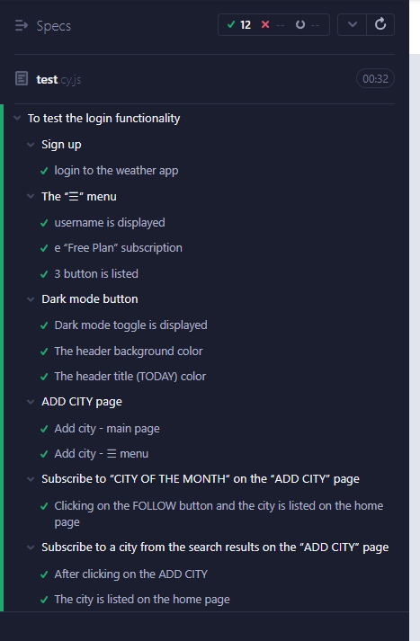

#### 1. Download and install _node.js_ from [nodejs.org](https://nodejs.org/en/download/)
#### 2. Install dependencies:
```sh
npm i
```
##### 2.1 Linux Prerequisites
 - ###### 2.1.1 Ubunti/Debian
```sh
apt-get install libgtk2.0-0 libgtk-3-0 libgbm-dev libnotify-dev libgconf-2-4 libnss3 libxss1 libasound2 libxtst6 xauth xvfb
```
 - ###### 2.1.2 CentOS
```sh
yum install -y xorg-x11-server-Xvfb gtk2-devel gtk3-devel libnotify-devel GConf2 nss libXScrnSaver alsa-lib
```
#### 3. Run the tests:
```sh
npm run cypress
```

